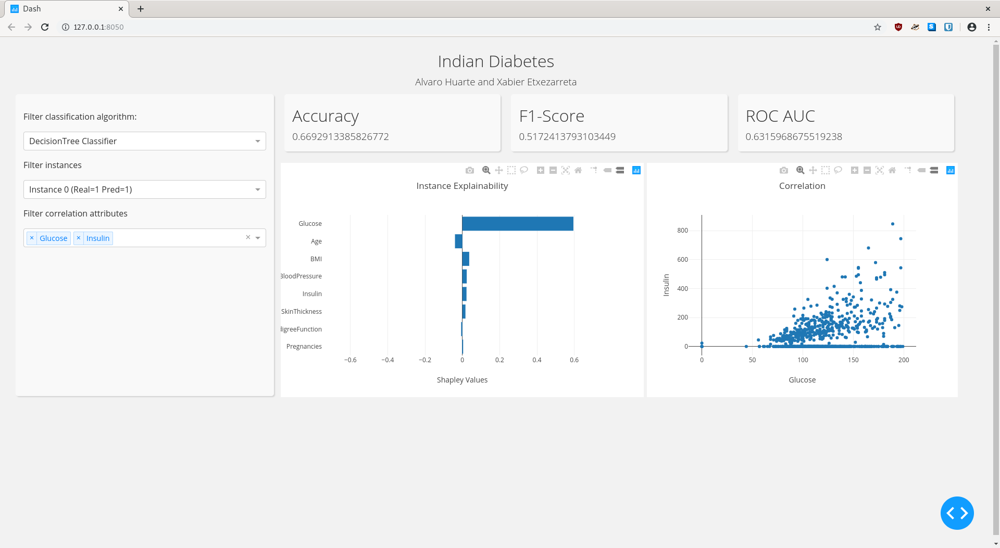

# VD_plotly_dash
Alvaro Huarte y Xabier Etxezarreta

### Introducción
El objetivo de este dashboard ha sido representar con el dataset de diabetes los resultados de la clasificación con diferentes algoritmos, la interpretabilidad de las predicciones y la correlaciones entre las variables. 

### Filtro de algoritmos
El objetivo de este filtro es dar la posibilidad al usuario de elegir el tipo de algoritmo de CLASIFICACIÓN, pudiendo de esta forma comparar los resultados obtenidos con cada uno de ellos.

Para que el usuario pueda realziar las comparaciones se han utilizado tres métricas: Accuracy, F1-Score y ROC-AUC. Estos indicadores son actualizados cuando el usuario cambia el filtro. Hemos decidido representar estos tres indicadores con valores numéricos debido a la facilidad de lectura, comprensión y comparación que conlleva utilizarlos. Cuando se selecciona un algoritmo se actualiza el dropdown de instancias.

### Filtro de instancias
EL objetivo es dar la opción al usuario de elegir que instancia quiere representar en la gráfica de barras horizontal para que pueda entender la predicción realizada. El dropdown esta compuesto por una lista de instancias, indicando en cada una de ellas el valor real de la clase y la predicción realizada por el algoritmo seleccionado. Con esto el usuario puede identificar mejor que predicciones se han realizado de forma correcta o de forma erronea. 

Se ha discutido la opción de introducir colores en las barras dependiendo si el valor es positivo o negativo, facilitando ver que variables afectan positivamente o negativamente a la predicción. Se pensó en utilizar el color verde en los valores positivos y el color rojo en los valores negativos. Esta posibilidad fue deseachada debido a que el color rojo representa algo negativo y el verde algo positivo cuando en lo representado un valor negativo no significa algo negativo y viceversa. Se llego a la conclusión, después de consultar a un experto (Dani), de que utilizar otros colores no aportan ninguna información extra al usuario por lo que esta idea fué desechada. 

En esta gráfica de barras se ha decidido representar de forma horizontal y posicionando el valor 0 en el centro del eje X para poder visualizar de forma más clara que variables aportan positivamente y negativamente. Las variables se han ordenado de mayor a menor (valor absoluto), en función a la aportación a la predicción. 

### Filtro de correlaciones
Su objetivo es mostrar la relación de dos variables a través de un gráfico de dispersión. Las opciones utilizadas en este filtro corresponden a cada una de las variables del dataset. Se ha utilizado un dropdown de tipo "multi", permitiendo al usuario realizar todas las combinaciones posibles entre dos variables. 

Como restricciones, la gráfica de correlaciones se mostrará unicamentes si se seleccionan dos variables, en el caso de seleccionar un número mayor o menor no aparecerá ninguna gráfica. Se ha utilizado el mismo color para representar todas las correlaciones. No se ha encontrado sentido el uso de los colores.    

### Preprocessing
Se han utilizado tres algoritmos basados en árboles: DecisionTree, RandomForest y XGBoost. El dataset se ha dividido en train y test, utilizando la parte de train para entrenar y la parte de test para el cáclulo de las métricas y el explainability de las instancias. 

Para el cálculo de la importancia de las variables en la predicción, se ha utilizado la libreria "SHAP". Esta libreria calcula los "shapeley values" de cada variable representando la importancia y la tendencia de cada variable. 

